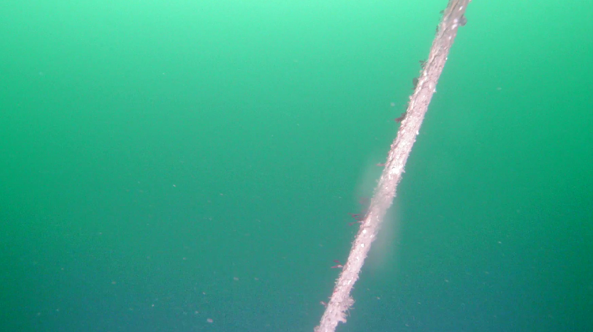
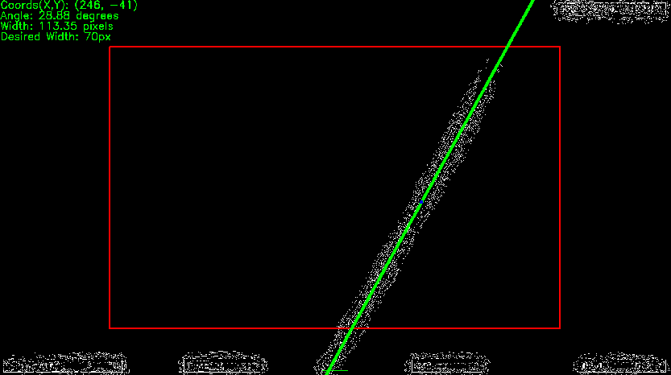

# Autonomous Mooring Line Inspection Using Blueye
This is a project which continues on the work conducted by [Nikolai Arntzen](https://github.com/Nikolaiarn) as part of his master thesis at NTNU.

The framework consists of a control system that ensures autonomous path following of a mooring line chain using a Blueye ROV. This project has an emphasis on only utilizing camera and IMU as sensors to ensure low-cost. The code has been tested on a Blueye Pioneer and Blueye X3.

A ROS 2 control system is structured with two nodes listening for IMU data and camera data. One node subscribes to the camera data and determines an estimat of the angle and position of the chain. Another node takes this data and outputs desired thruster commands in surge, sway, heave, and yaw. These values are then transmitted to thruster values by the onboard SDK which includes thrust allocation. 

The code is developed for Ubuntu 22.04.5 LTS (Jammy Jellyfish). It is strongly advised to run from a native Linux computer or a dual boot. Applying and testing code on video playback has been tested from macOS but we strongly discourage using macOS for other purposes.

## Project details
This project is developed by Christian Lindahl Elseth and Jakob Rude Øvstaas as part of a master thesis at Marine Technology NTNU. A journal paper summarizing the work is to be published summer of 2025.
<p float="left">
  
  
</p>

## Current work
This spring the focus is to improve the current algorithm and ensure the ROV is able to conduct its mooring line inspection both ways. By "both ways" we mean that the ROV completes a full inspection from sea surface to sea bottom and then back to surface. Another focus is to improve the current algorithm for detecting the mooring line and its angle. Currently as is, the algorithm struggles as the lighting conditions change. A more dynamic algorithm is therefore being developed currently.

## Setup guide
**Install [ROS2 Humble](https://docs.ros.org/en/humble/Installation/Ubuntu-Install-Debs.html)**

Clone this repository:
```sh
git clone https://github.com/jakobbbbbbb/AutonomousBlueye.git
```

Clone this repository which converts YOLOv5 to ROS2 messages: (Note: there are two separates repos to be cloned)
https://github.com/Ar-Ray-code/YOLOv5-ROS.git

Install all necessary libraries:
```sh
pip install -r requirements.txt
```
## Connection guide
1. Power on Blueye and Surface Unit. Connect computer to Blueye Surface Unit Wi-Fi. Standard password is 1234567890
2. Initialize dive in the Blueye app and turn on auto-heading and auto-depth (this is subject to implementation in the code at a later point). 
3. Source the code:
```sh
source /opt/ros/humble/setup.bash
```
3. Build and source:
```sh
colcon build && source install/setup.bash
```
4. Run the launch file:
```sh
ros2 launch real_blueye_launch real_blueye.launch.py
```

**Note:**  
Upon making changes to the code make sure to save the file, rebuild and source the workspace again (step 3 & 4 above).
